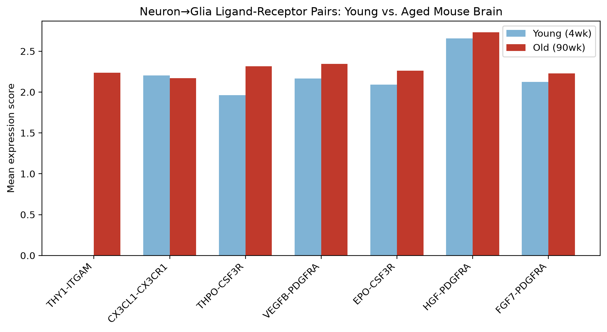

# Neuron-Glia Communication Mapping in Mouse Brain Aging

## Project Status: Educational/Learning Project
This project was completed as an independent learning exercise to practice Python, Squidpy, Scanpy, and single-cell RNA-seq analysis. The goal was to explore ligand-receptor interactions between neurons and glial cell types in young and aged mouse brain datasets.

This analysis is not intended to constitute novel biological research or validated scientific conclusions. Results should be interpreted as exploratory and may contain methodological limitations or inaccuracies.

## Skills Practiced
- Python environment setup (venv, pip) and running Jupyter notebooks in VS Code
- Single-cell data handling with scanpy (AnnData objects, metadata filtering, obs/var structures)
- Statistical inference with squidpy (permutation testing for ligand-receptor co-expression)
- Debugging real-world package and data compatibility issues (gene ID mismatches, species handling, API changes)
- Working with pandas (filtering, sorting, set comparisons between result tables)
- Data visualization with matplotlib (grouped bar charts)
- Critically evaluating results rather than accepting default output — catching a ranking artifact by checking raw values before treating it as a finding
- Version control and documentation with Git and GitHub

## Motivation
This project explores ligand-receptor communication patterns between neurons and glial cells (astrocytes, microglia, oligodendrocytes, and oligodendrocyte precursor cells) in young vs. aged mouse brain tissue, as an independent exploration of the kind of connectivity questions studied by sequencing-based approaches like Connectome-seq.

## Data
Allen, Blosser, Sullivan, Dulac & Zhuang, "Molecular and spatial signatures of mouse brain aging at single-cell resolution," Cell (2022).
Source: [CellxGene](https://cellxgene.cziscience.com/collections/31937775-0602-4e52-a799-b6acdd2bac2e)
79,667 cells total — 40,972 young (4wk), 38,695 aged (90wk); 13 annotated cell types.

## Method
Used squidpy's ligand-receptor inference (`sq.gr.ligrec`) to identify statistically significant signaling interactions between neurons and four glial cell types, comparing young and aged tissue separately. Mouse gene symbols were matched against squidpy's default human (CellPhoneDB) ligand-receptor database via uppercase symbol matching, since the mouse-specific database failed to build correctly in this environment.

## Key Findings

1. **Core signaling architecture is stable with age.** 14 of the top 20 significant neuron-to-glia pairs were shared between young and old, dominated by FGF/PDGF family signaling to PDGFRA (the canonical OPC marker) and IL34/SOCS2 signaling to CSF1R/CSF3R (microglial receptors) — a good sign the pipeline recovers known, expected biology.

2. **THY1-ITGAM (neuron→microglia) emerges with age.** This pair was undetectable (below testing threshold) in young tissue but clearly present and significant in old tissue (mean = 2.23, p < 0.001). ITGAM (CD11b) is an established marker of microglial activation, making this a biologically plausible age-related signal.

3. **A modest, consistent strengthening across several pairs.** Five pairs (FGF7/HGF/VEGFB→PDGFRA, EPO/THPO→CSF3R) were present and significant in both groups, but all five showed higher expression in old tissue (+3% to +18%) — a directionally consistent trend, though smaller in magnitude than finding 2.

4. **A caution about rank-based comparisons.** CX3CL1-CX3CR1 initially appeared in the young top-20 but not the old top-20, suggesting fractalkine signaling loss with age. Checking raw values showed this was a top-20 cutoff artifact — expression was nearly identical between groups (2.099 vs. 2.096, both p < 0.001). Included here as a reminder to verify raw values behind any rank-based comparison before treating it as a finding.

## Limitations
- Ligand-receptor co-expression is correlational, not proof of direct physical interaction or functional signaling.
- Used a human reference database via ortholog symbol matching, since the mouse-specific database failed to build in this environment — not every pair has a clean 1:1 mouse ortholog.
- Single dataset, two time points — not validated against a second dataset.

## How to Run
1. Clone this repository
2. Create a virtual environment and install dependencies: `pip install -r requirements.txt`
3. Download the dataset from [CellxGene](https://cellxgene.cziscience.com/collections/31937775-0602-4e52-a799-b6acdd2bac2e) into a `data/` folder
4. Run `analysis.ipynb`

## Acknowledgments
Dataset from Allen, W.E., Blosser, T.R., Sullivan, Z.A., Dulac, C., Zhuang, X. (2022). Molecular and spatial signatures of mouse brain aging at single-cell resolution. Cell, 186(1), 194-208.
